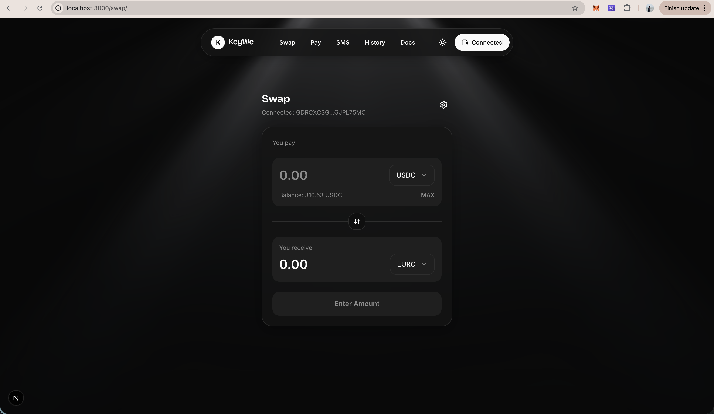
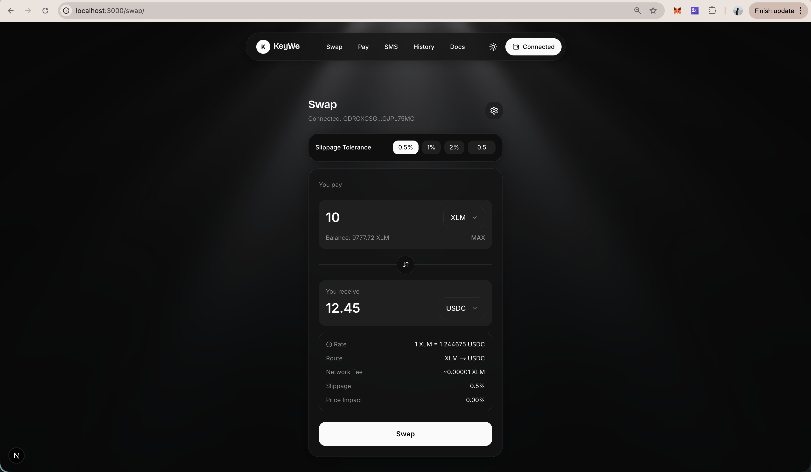
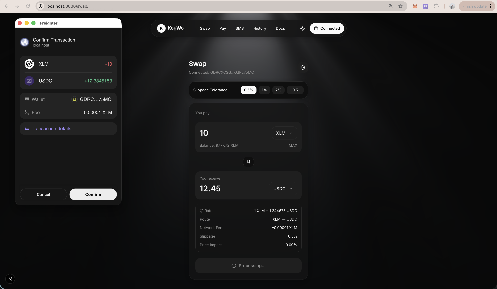
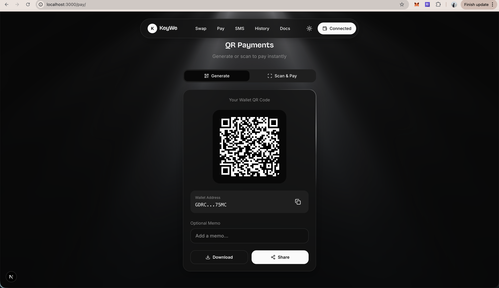
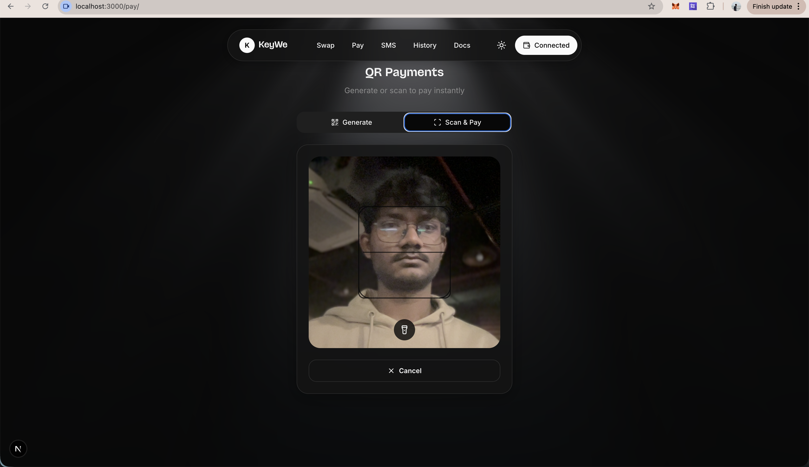

KeyWe
=====

**KeyWe** is a Stellar swap and payments app with a Next.js frontend, an Express backend, and a Soroban smart contract workspace.

## Project description

KeyWe combines wallet-based Stellar payments, quote-driven swap routing, and a Soroban contract integration layer. Users connect Freighter, fetch swap quotes from the backend, sign transactions locally, and can now see a contract-backed preview directly in the active frontend.

## Smart contract integration files

These are the main files where the frontend-to-contract integration is implemented:

- `lovable-next/src/app/swap/page.tsx`
- `lovable-next/src/lib/contract.ts`
- `lovable-next/src/lib/api.ts`
- `lovable-next/src/lib/walletContext.tsx`
- `backend/src/routes/contract.ts`
- `backend/src/services/contractService.ts`
- `contract/src/lib.rs`

## Current contract flow

- The active frontend app is `lovable-next/`.
- Swap execution still uses wallet-signed Stellar path payment transactions.
- Soroban integration is now wired into the frontend through a contract-backed preview flow.
- To activate the contract preview in the UI, set `CONTRACT_ID`, `SOROBAN_RPC_URL`, and `SECRET_KEY` in the backend after deploying the contract from `contract/src/lib.rs`.

## Repository layout

```text
KeyWe/
|-- backend/        # Express + TypeScript API
|-- contract/       # Soroban contract (Rust -> WASM)
|-- lovable-next/   # Active Next.js frontend
|-- mobile/         # Mobile experiments
`-- lovable/        # Earlier frontend iteration
```

## Local run

Backend:

```bash
cd backend
npm install
npm run dev
```

Frontend:

```bash
cd lovable-next
npm install
npm run dev
```

Default local URLs:

- Frontend: `http://localhost:3000`
- Backend: `http://localhost:3001`

## Screenshots







