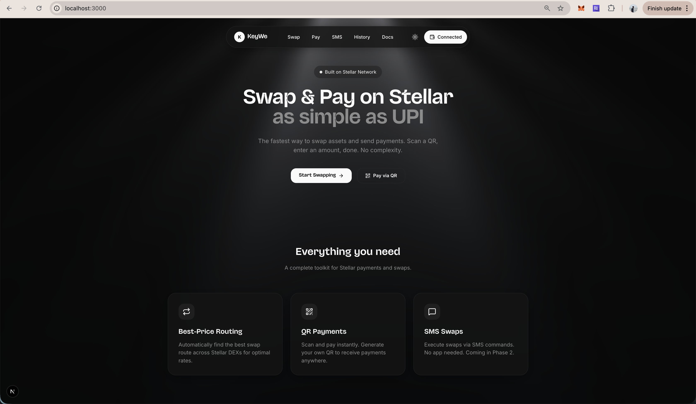

KeyWe
=====

**KeyWe** is a **swap aggregator for Stellar**: a dApp that finds efficient swap routes (multi-hop where needed), shows users the quote/route preview, and executes swaps via Stellar primitives (and an optional Soroban contract layer).

## Project description

The platform already delivers real, production-ready value through a smart swap aggregator powered by path-based routing using "GET	/paths/strict-send" and "GET	/paths/strict-receive" mechanisms as been provided by the Stellar's latest ledger known as Horizon. This allows the system to automatically discover the most efficient routes across multiple DEXs and liquidity pools, ensuring optimal pricing and minimal slippage. Users can make QR code–based payments with UPI-like simplicity, securely connect via the Freighter wallet, and view a fully on-chain, auditable transaction history for complete transparency.

Looking ahead, the platform is evolving into a bridge between traditional finance and blockchain through upcoming Tokenized Security Deposits, where real-world deposits are converted into programmable tokens locked in smart contracts with transparent rules and automatic settlement. This RWA architecture is designed to scale beyond rentals into utilities, vehicles, education fees, and more—bringing together payments, intelligent routing, swaps, and real-world value under one vision: Where Payments Meet Programmability.

## Contract address

Since the contract-execution path is not finalized or audited yet, we intentionally didn’t deploy it for the demo. Native path payments already give us real on-chain execution, real liquidity routing, and wallet-level signing — without introducing unaudited logic.

## Problem statement (what we’re solving and how)

On Stellar, liquidity can be fragmented across orderbooks, AMMs, and multi-hop path possibilities. For users, that typically means:
- hard-to-predict outcomes (slippage/price impact)
- extra steps to find the best route
- higher risk of failed or suboptimal swaps

**KeyWe solves this** by running an off-chain routing + simulation layer that:
- builds possible swap paths between assets
- simulates expected output and ranks routes
- returns a route payload the UI can present (and later execute)

## Features

- **Route discovery & quoting**: Find and rank potential routes for a swap.
- **Multi-hop routing**: Support swaps that require intermediate assets (e.g., `USDC → XLM → EURC`).
- **Swap execution flow**: Execute swaps through backend orchestration (with hooks for Soroban execution).
- **Wallet-ready UI**: Freighter integration in the dApp UI (repo includes Stellar SDK usage).
- **Contract management endpoints**: Upload/deploy/invoke helpers for the Soroban WASM lifecycle.


### Repository layout

```
KeyWe/
├── backend/          # Express + TypeScript API
├── contract/         # Soroban contract (Rust → WASM)
└── lovable-next/     # Frontend
```

Quick run:

```bash
npm install
npm run dev
```

This starts:
- **Backend**: `http://localhost:3001`
- **Frontend**: `http://localhost:3000`

## Future scope and plans

- **Deploy Soroban contract** to testnet/mainnet and publish contract IDs.
- **Real AMM/pool integrations** + more robust hybrid routing across sources.
- **Route splitting** (when supported) for better price execution on larger swaps.
- **Caching & performance** improvements (orderbook snapshots, quote memoization).
- **Safety hardening**: slippage guards, better validation, failure retries, audit readiness.
- **Better UX**: richer route visualizations, execution tracking, improved history & analytics.


## Screenshots
>
